

<h1 align="center">BLACKBOX ANALYSIS READOUTS

</h1>

    Pose tracking, behavior and paw weight-bearing readouts generated by Palmreader from Blackbox recordings
     
    <a href="#plantar-readouts">Jump to Plantar Readouts</a>
    &middot;
    <a href="#postural-readouts">Jump to Postural Readouts</a>

***
<!-- TABLE OF CONTENTS -->

  
Table of Contents

  <ol>
    <li><a href="#overview">Overview</a></li>
    <li><a href="#analysis-pipeline">Analysis Pipeline</a></li>
    <li><a href="#deeplabcut-body-part-labels">DeepLabCut Body Part Labels</a></li>
    <li><a href="#global-readouts">Global Readouts</a></li>
    <li><a href="#behavioral-readouts">Behavioral Readouts</a></li>
    <li><a href="#anatomical-readouts--definitions">Anatomical Readouts & Definitions</a></li>
    <li><a href="#behavioral-contexts">Behavioral contexts</a></li>
    <li><a href="#plantar-readouts">Plantar Readouts</a></li>
    <li><a href="#postural-readouts">Postural Readouts</a></li>
    <li><a href="#tracking-quality-readouts">Tracking Quality Readouts</a></li>
  </ol>

***

## Overview

This repository contains the analysis code that Palmreader runs on Blackbox recordings, and this document defines every readout it produces. Readout names below match the column headers of the summary spreadsheet. For operating the Blackbox instrument and recording experiments, see the Blackbox Operating Manual.

New behavioral outputs are frequently added. Below is a non-exhaustive list of DeepLabCut pose labels and behavioral readouts that can be generated from Palmreader.

(<a href="#readme-top">back to top</a>)

## Analysis Pipeline

Each recording is analyzed in three steps:

1. **Pose tracking:** DeepLabCut labels the body parts of the animal in every frame of the transmitted-light ("TRANS") video (see [DeepLabCut Body Part Labels](#deeplabcut-body-part-labels)).
2. **Feature extraction:** per-frame features are computed from the pose labels and the Intellitouch™ ("FTIR") video, including paw luminance, print size and pressure index, body part distances and angles, and per-frame behavior classifications. These are saved for each recording in `features.h5`.
3. **Summary:** per-frame features are summarized over each recording, or each time bin, into one row of the summary spreadsheet (`summary.csv`).

(<a href="#readme-top">back to top</a>)

## DeepLabCut Body Part Labels

| Skeleton | Rodent |
|---|---|
| 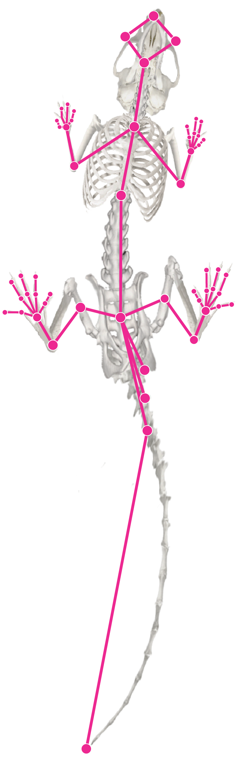 | 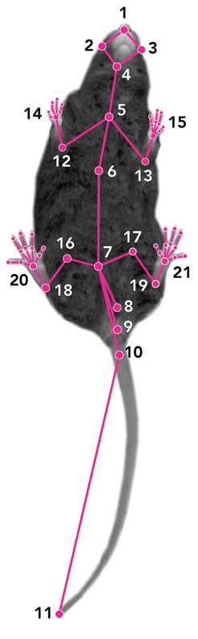 |

| Right Fore Paw (RFP) | Left Fore Paw (LFP) |
|---|---|
| 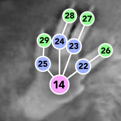 | 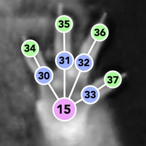 |

| Right Hind Paw (RHP) | Left Hind Paw (LHP) |
|---|---|
| 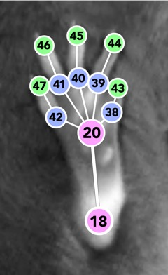 | 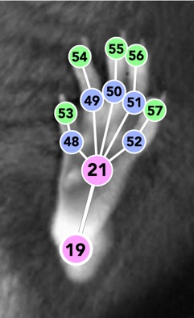 |

| # | Label | # | Label |
|---|---|---|---|
| 1 | nose | 30 | LFP proximal 1st digit |
| 2 | right cheek | 31 | LFP proximal 2nd digit |
| 3 | left cheek | 32 | LFP proximal 3rd digit |
| 4 | neck | 33 | LFP proximal 4th digit |
| 5 | sternal notch | 34 | LFP distal 1st digit |
| 6 | xyphoid | 35 | LFP distal 2nd digit |
| 7 | sacrum | 36 | LFP distal 3rd digit |
| 8 | genital | 37 | LFP distal 4th digit |
| 9 | anal | 38 | RHP proximal 1st digit |
| 10 | tail base | 39 | RHP proximal 2nd digit |
| 11 | tail tip | 40 | RHP proximal 3rd digit |
| 12 | right elbow | 41 | RHP proximal 4th digit |
| 13 | left elbow | 42 | RHP proximal 5th digit |
| 14 | right fore paw (RFP) | 43 | RHP distal 1st digit |
| 15 | left fore paw (LFP) | 44 | RHP distal 2nd digit |
| 16 | right femur | 45 | RHP distal 3rd digit |
| 17 | left femur | 46 | RHP distal 4th digit |
| 18 | right heel | 47 | RHP distal 5th digit |
| 19 | left heel | 48 | LHP proximal 1st digit |
| 20 | right hind paw (RHP) | 49 | LHP proximal 2nd digit |
| 21 | left hind paw (LHP) | 50 | LHP proximal 3rd digit |
| 22 | RFP proximal 1st digit | 51 | LHP proximal 4th digit |
| 23 | RFP proximal 2nd digit | 52 | LHP proximal 5th digit |
| 24 | RFP proximal 3rd digit | 53 | LHP distal 1st digit |
| 25 | RFP proximal 4th digit | 54 | LHP distal 2nd digit |
| 26 | RFP distal 1st digit | 55 | LHP distal 3rd digit |
| 27 | RFP distal 2nd digit | 56 | LHP distal 4th digit |
| 28 | RFP distal 3rd digit | 57 | LHP distal 5th digit |
| 29 | RFP distal 4th digit | | |

To generate body part labels, Palmreader uses DeepLabCut (version 3.0.2)1,2, trained by labeling video frames of Blackbox-generated videos of mice and rats of various strains and colors. **When publishing Blackbox data scored using the Palmreader software suite, please cite the following source literature describing DeepLabCut1 and the DLC Python package2:**

1. Mathis A, et al.., Nature Neuroscience. 2018 doi: 10.1038/s41593-018-0209-y
2. Nath T, Mathis A, et al., Nature Protocols. 2019 doi: 10.1038/s41596-019-0176-0

(<a href="#readme-top">back to top</a>)

## Global Readouts

**total recording_time (min)** is the duration of the recording analyzed, starting from the first frame in which the animal is detected.

**PV: bin start-end (min)** is the time window within the recording that each summary row is calculated from.

**bin duration (min)** is the total duration (in minutes) for the recording that each of the summary readout rows is calculated from.

**distance_traveled (pixel)** represents the total linear distance moved by the animal. It is calculated by summing all frame-to-frame changes in location of the animal's body centroid across all video frames. The body centroid is the tracking-confidence-weighted average position of the sacrum (7), xyphoid (6), sternal notch (5), neck (4), left and right femur (16, 17) and left and right elbow (12, 13) labels.

Distance unit conversion calculator: (Blackbox R1, Camera A, mouse recording): 1 pixel = 0.3 mm

**time_spent_in_center (seconds)** is the time the body centroid spends in the center square of a 3 x 3 grid dividing the field of view.

(<a href="#readme-top">back to top</a>)

## Behavioral Readouts

Palmreader classifies each video frame into the behaviors below, using the DeepLabCut body part labels. These classifications are reported as time spent, and are also used as the behavioral contexts for the plantar readouts (see [Behavioral contexts](#behavioral-contexts)).

**time_spent_locomotion (seconds)**
The time the animal spends walking. A frame is classified as locomotion when the body centroid is more than 20 pixels from its average location over the preceding 0.5 seconds (threshold defined at 45 frames per second and scaled for other frame rates), and the animal stays above this threshold for at least 1 second.

**time_spent_not_moving (seconds)**
The time the animal spends still. A frame is classified as not moving when all of the following labels move less than 0.5 pixels per frame (defined at 45 frames per second and scaled for other frame rates): sacrum (7), xyphoid (6), sternal notch (5), neck (4), nose (1) and all four paws (14, 15, 20, 21). The animal must stay still for at least 0.5 seconds.

**time_spent_left_turn (seconds)** and **time_spent_right_turn (seconds)**
The time the animal spends turning its body to the left or right. A turn is detected when the body axis (from tail base (10) to nose (1)) rotates faster than 45 degrees per second for at least 0.4 seconds.

(<a href="#readme-top">back to top</a>)

## Anatomical Readouts & Definitions

**Paw:**
The four paws are named [LHP: left hindpaw, RHP: right hindpaw, LFP: left forepaw, and RFP: right forepaw] according to their anatomical positions.

**Paw print size:**
The paw print size (pixel area) measures the area of the contact of a given paw in each time frame. The pixel area is the number of pixels in the FTIR signal induced by a given paw above a pixel intensity threshold.

**Paw luminance:**
The paw luminance (pixel intensity) measures the sum of all pixel intensity signals induced by a given paw in each time frame.

**Pressure Index:**
The paw pressure index (pixel intensity/area) measures the "pressure" of a given paw in each time frame, calculated as the paw luminance divided by the paw print size.

> **Formulary for luminance readout labels (below):**
> `{paw}` is a placeholder that can take one of the four paws (e.g., LHP for left hind paw).
> `{measure}` can take one of the three measures [print_size, luminance, pressure-index].
> `{context}` can take one of the behavioral contexts [none (whole recording), locomoting, not_moving]; see [Behavioral contexts](#behavioral-contexts).

**Average {paw} {measure}:**
The average {measure} of each {paw} across the time. Per-paw averages are not reported as separate readouts; they can be recovered as the overall {measure} multiplied by the relative {paw} {measure}.

**Overall {measure}:**
The overall {measure} is the sum of the average {measure} of all four paws.

**Relative {paw} {measure}:**
The average {measure} of each {paw} normalized by the overall {measure}. The four relative values of a {measure} sum to 1.

- **Ratio {paw 1} {paw 2} {measure}:**
  Ratios are calculated from averages: the average {paw 1} {measure} divided by the average {paw 2} {measure}. Hind paw ratios are reported in both directions, right over left (r/l) and left over right (l/r), so the injured paw can be placed in the numerator.
- For front-to-hind ratios, the {front} is the sum of both front paws, and the {hind} is the sum of both hind paws.
- For standing measures, the animal is classified as standing if neither of the animal's front paws are contacting the floor.
- **{paw} lifted time:**
  The lifted time (seconds) of each {paw} is calculated by summing up the time when the given {paw} is not contacting the floor.

Relative and ratio readouts are reported with 4 decimal places; all other readouts are reported with 2 decimal places.

(<a href="#readme-top">back to top</a>)

## Behavioral contexts

In addition to the whole recording, the overall, relative and hind paw ratio readouts are also calculated within two behavioral contexts, using only the video frames classified as that behavior (see [Behavioral Readouts](#behavioral-readouts)):

- **locomoting:** frames in which the animal is walking. Readout names contain `_locomoting_`.
- **not_moving:** frames in which the animal is still. Readout names contain `_not_moving_`.

Weight bearing during locomotion and at rest can differ after injury. For example, an animal may guard an injured paw while resting but load it more evenly while walking. If an animal spends little or no time in a behavior during a recording or time bin, readouts for that context are based on few frames and are less reliable, or are left empty if the behavior does not occur.

(<a href="#readme-top">back to top</a>)

## Plantar Readouts

**average_overall_print_size (pixel area)** represents the total paw contact area of the animal: the sum of the average print size of all four paws across all timepoints.

**average_overall_luminance (pixel intensity)** is the sum of the average luminance of all four paws.

**average_overall_pressure-index (pixel intensity/area)** is the sum of the average pressure index of all four paws.

The plantar readouts below are reported for each {measure} [print_size, luminance, pressure-index]. Units: print_size in pixel area, luminance in pixel intensity, pressure-index in pixel intensity/area.

| Readout | Contexts reported | Description |
|---|---|---|
| average_overall_{measure} | whole recording, locomoting, not_moving | Sum of the average {measure} of all four paws |
| relative_{paw}_{measure} (ratio) | whole recording, locomoting, not_moving | Average {measure} of {paw} divided by the overall {measure} |
| average_hind_paw_{measure}_ratio (r/l) and (l/r) | whole recording, standing, locomoting, not_moving | Average right hind paw {measure} divided by the average left hind paw {measure} (r/l), or the reverse (l/r) |
| average_front_to_hind_paw_{measure}_ratio | whole recording | Sum of the average front paw {measure} divided by the sum of the average hind paw {measure} |

Context-specific readouts insert the context name after `average_` or `relative_`. For example:

- average_overall_luminance (pixel intensity)
- average_not_moving_overall_luminance (pixel intensity)
- relative_LHP_luminance (ratio)
- relative_locomoting_LHP_luminance (ratio)
- average_hind_paw_luminance_ratio (l/r)
- average_standing_hind_paw_luminance_ratio (l/r)
- average_locomoting_hind_paw_luminance_ratio (l/r)
- average_not_moving_hind_paw_luminance_ratio (l/r)

Paw lifted time readouts:

- LHP_paw_lifted_time (seconds)
- RHP_paw_lifted_time (seconds)
- LFP_paw_lifted_time (seconds)
- RFP_paw_lifted_time (seconds)
- both_front_paws_lifted (seconds)

(<a href="#readme-top">back to top</a>)

## Postural Readouts

| | |
|---|---|
| 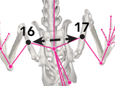 | **femur_width** (pixel) The average pixel distance between the left femur (17) and right femur (16) across all time points. |
| 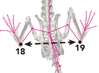 | **heel_distance** (pixel) The average pixel distance between the left (19) and right (18) heels across all time points. |
| 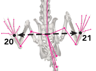 | **hind_paws_distance** (pixel) The average pixel distance between the left (21) and right (20) hind paws across all timepoints. |
| 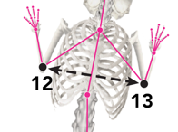 | **elbow_width** (pixel) The average pixel distance between the left (13) and right (12) elbow joints across all timepoints. |
| 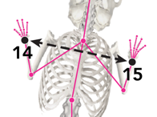 | **front_paws_distance** (pixel) The average pixel distance between the left (15) and right (14) front paws across all timepoints. |
| 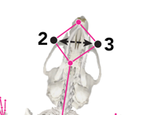 | **cheek_distance** (pixel) The average pixel distance between the left (3) and right (2) cheeks across all timepoints. |
| 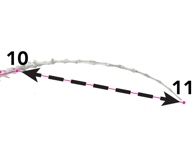 | **tailbase_tailtip_distance** (pixel) The average pixel distance between the tailbase (10) and the tailtip (11) across all timepoints. |
| 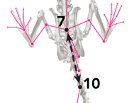 | **sacrum_tailbase_distance** (pixel) The average pixel distance between the sacrum (7) and the tailbase (10) labels across all timepoints. |
| 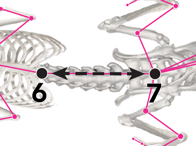 | **sacrum_xyphoid_distance** (pixel) The average pixel distance between the sacrum (7) and the xyphoid process (caudal sternum) (6) across all timepoints. |
| 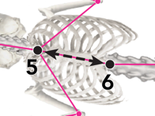 | **xyphoid_sternal-notch_distance** (pixel) The average pixel distance between the suprasternal notch (5) and the xyphoid process (6) (the rostral and caudal ends of sternum, respectively) across all timepoints. |
| 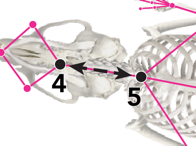 | **sternal-notch_neck_distance** (pixel) The average pixel distance between the suprasternal notch (5) and the neck (4) midpoint (approximating the position of the thyroid cartilage) across all timepoints. |
| 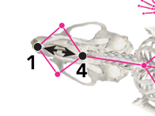 | **neck_snout_distance** (pixel) The average pixel distance between the midpoint of the neck (4) (i.e., thyroid cartilage) and the tip of the snout across all timepoints. |

The following angle readouts represent the orientation of the two vectors defined by the centerline of the corresponding structures. Each angle readout is reported as the average across all timepoints, and as a separate `{angle} standard deviation (degree)` readout giving the standard deviation of the angle across all timepoints.

| | |
|---|---|
| 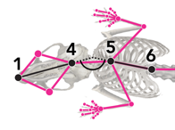 | **chest_head_angle** (degree) Where chest is a vector formed along the sternal centerline from suprasternal (5) to xyphoid (6), and head is a vector between the neck (4) and snout (1), the chest_head angle is the inclination that forms at their intersection. Leftward (counterclockwise movement) of the head produces a positive value, while a rightward (clockwise) turn of the head results in a negative value. |
| 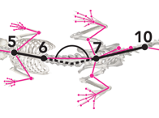 | **hip_chest_angle** (degree) Here, hip is a vector formed by the sacrum (7) and tailbase (10) labels, and chest is the sternal centerline vector formed between suprasternal (5) and xyphoid (6). The intersection of these vectors forms the hip_chest angle. Turning of the chest leftward (counterclockwise), produces a positive hip_chest angle value, and rightward turn of the chest produces a negative value. |
| 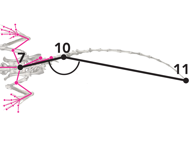 | **tail_hip_angle** (degree) For this angle, tail is defined by a vector between the tailbase (10) and tailtip (11) labels, and hip is a vector formed by the sacrum (7) and tailbase (10) labels. Turning of the tail leftward (counterclockwise), produces a positive tail_hip angle value, and rightward turn of the tail produces a negative value. |
| 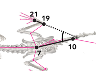 | **LHP_paw-angle** (degree) This angle is defined by the intersection of a vector from tailbase (10) to xyphoid (6), and a vector from left heel (19) to the left hindpaw centroid (21). Turning of the left hindpaw leftward (counterclockwise), produces a positive LHP paw angle value, and rightward turn of the paw produces a negative value. |
| 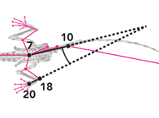 | **RHP_paw-angle** (degree) This angle is defined by the intersection of a vector from tailbase (10) to xyphoid (6), and a vector from right heel (18) to the right hindpaw centroid (20). Turning of the right hindpaw rightward (clockwise), produces a positive RHP paw angle value, and leftward turn of the paw produces a negative value. |
| 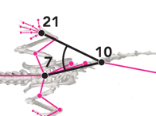 | **LHP_limb-angle** (degree) This angle is defined by the intersection of a vector from tailbase (10) to sacrum (7), and a vector from tailbase (10) to the left hindpaw centroid (21). |
| 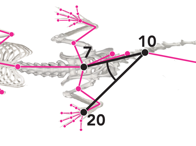 | **RHP_limb-angle** (degree) This angle is defined by the intersection of a vector from tailbase (10) to sacrum (7), and a vector from tailbase (10) to the right hindpaw centroid (20). |
| 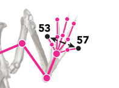 | **LHP_toe-spread** (pixel) This readout is the distance between the LHP distal 1st digit (53) to LHP distal 5th digit (57). |
| 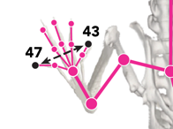 | **RHP_toe-spread** (pixel) This value represents the distance between the RHP distal 1st digit (43) to RHP distal 5th digit (47). |
| 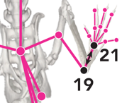 | **LHP_paw-length** (pixel) This measurement is the distance between the left heel (19) and the LHP distal 3rd digit (55). A change in paw length occurs upon dorsiflexion of the paw, which reduces the apparent distance between the heel (19) and the distal 3rd digit (55), such as when the heel is lifted while the toes are stationary against the glass. |
| 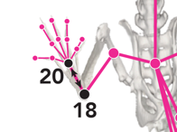 | **RHP_paw-length** (pixel) This measurement is the distance between the right heel (18) and the RHP distal 3rd digit (45). A change in paw length occurs upon dorsiflexion of the paw, which reduces the apparent distance between the heel (18) and the distal 3rd digit (45), such as when the heel is lifted while the toes are stationary against the glass. |

(<a href="#readme-top">back to top</a>)

## Tracking Quality Readouts

**average_{paw}_tracking_likelihood** is the average DeepLabCut confidence (0 to 1) for the label of each {paw} across all timepoints. Low values indicate the paw was often hidden, poorly lit, or hard to identify, which can affect the accuracy of the plantar readouts for that paw.

**paws_tracking_quality_control_flag** is set to 1 when the average tracking likelihood of either hind paw is below 0.4, or of either front paw is below 0.6, and is 0 otherwise. Recordings flagged with 1 should be reviewed (for example, by checking the labeled video) before their plantar readouts are interpreted.

(<a href="#readme-top">back to top</a>)

